# 第一部分  DPDK基础篇

# 1  认识DPDK

## 1.7  实例

1. helloworld，启动基础运行环境
2. skeleton，最精简得单核报文收发骨架
3. l3fwd，三层转发是DPDK用于发布性能测试指标的主要应用

### 1.7.1  HelloWorld

# 第三章 并行计算
## 3.1 多核性能和可扩展性
> *Amdahl定律*告诉我们，假设一个任务的工作量不变，多核并行计算理论时延加速上限取决于那些不能并行处理部分的比例

## 3.1.2 多核处理器
> 超线程（Hyper-Threading）在一个处理器中提供两个逻辑执行线程，逻辑线程共享流水线、执行单元和缓存。
>
> 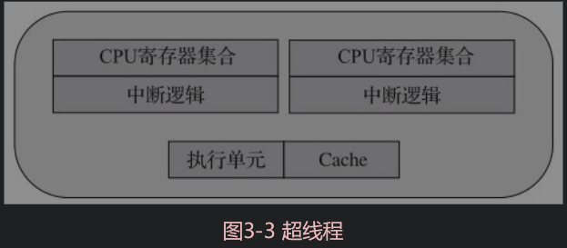

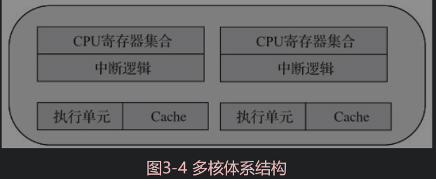

> 1. 处理器核数
>
> 2. 逻辑处理器核心数
>
> 3. 系统物理处理器封装ID
>
> 4. 系统逻辑处理器ID
>
>    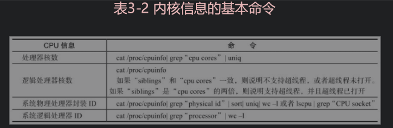

### 3.1.3 亲和性

> 使用亲和性的三个原则：
>
> 1. 有大量计算要做
> 2. 测试复杂的应用程序
> 3. 运行时间敏感的、决定性的线程

> cgroup是controlgroup的缩写，是Linux内核提供的一种可以限制、记录、隔离进程组所使用的物理资源（如：CPU、内存、I/O等）的机制。

> 理解处理器的体系结构以及微架构的设计，对于调优或者高效的代码设计都会很有帮助。这里推荐读者阅读**64-ia-32架构优化手册**，手册中会从前端优化、执行core优化、访存优化、预取等多个方面讲解各类技巧

#### 3.2.2.1 SIMD简介

> SIMD指令操作的寄存器相对于通用寄存器（general-purpose register, RPRS）更宽，128bit的XMM寄存器或者256bit的YMM寄存器，有2倍甚至4倍于通用寄存器的宽度（在64bit架构上）。所以，用SIMD指令的一个直接好处是最大化地利用一级缓存访存的带宽

# 第四章 同步互斥机制

## 4.1 原子操作

> 对原子操作的简单描述就是：多个线程执行一个操作时，其中任何一个线程要么完全执行完此操作，要么没有执行此操作的任何步骤，那么这个操作就是原子的。原子操作是其他内核同步方法的基石。

> 在x86平台上，总的来说，CPU提供三种独立的原子锁机制：**原子保证操作**、**加LOCK指令前缀**和**缓存一致性协议**。

> CMPXCHG这条指令:处理器会自动地遵循LOCK的语义，可见该指令是一条原子的CAS单指令操作。它可是实现很多无锁数据结构的基础

> 硬件原子操作，软件原子操作

## 4.2 读写锁

> 写自旋锁访问共享资源：
>
> 1. 申请锁
> 2. 获得锁后，读写共享资源
> 3. 释放锁

> 读写自旋锁主要用于比较短小的代码片段，线程等待期间不应该进入睡眠状态，因为睡眠/唤醒操作相当耗时,大大延长了获得锁的等待时间，所以我们要求忙等待

## 4.3 自旋锁

> 何谓自旋锁（spin lock）？它是为实现保护共享资源而提出一种锁机制。其实，自旋锁与互斥锁比较类似，它们都是为了解决对某项资源的互斥使用。无论是互斥锁，还是自旋锁，在任何时刻，最多只能有一个保持者，也就说，在任何时刻最多只能有一个执行单元获得锁。任何时刻最多只能有一个执行单元获得锁。但是两者在调度机制上略有不同。对于互斥锁，如果资源已经被占用，资源申请者只能进入睡眠状态。但是自旋锁不会引起调用者睡眠，如果自旋锁已经被别的执行单元保持，调用者就一直循环在那里看是否该自旋锁的保持者已经释放了锁，“自旋”一词就是因此而得名。

### 4.3.1 自旋锁的缺点

> 自旋锁必须基于CPU的数据总线锁定，它通过读取一个内存单元（spinlock_t）来判断这个自旋锁是否已经被别的CPU锁住。记住上面提及到的：锁定数据总线的指令只能保证一个指令操作期间CPU独占数据总线:
>
> 1. 自旋锁一直占用CPU，它在未获得锁的情况下，一直运行——自旋，所以占用着CPU，如果不能在很短的时间内获得锁，这无疑会使CPU效率降低。
> 2. 在用自旋锁时有可能造成死锁，当递归调用时有可能造成死锁，调用有些其他函数（如copy_to_user()、copy_from_user()、kmalloc()等）也可能造成死锁。
>
> 因此我们要慎重使用自旋锁，自旋锁只有在内核可抢占式或SMP的情况下才真正需要，在单CPU且不可抢占式的内核下，自旋锁的操作为空操作。自旋锁适用于锁使用者保持锁时间比较短的情况。

## 4.4 无锁机制

### 4.4.1 linux内核无锁环形缓冲

> 在Linux内核代码中，kfifo就是采用无锁环形缓冲的实现。kfifo采用了并行无锁技术，kfifo实现的单生产/单消费模式的共享队列是不需要加锁同步的。更多的细节可以阅读Linux内核代码中的kififo的头文件（include/linux/kfifo.h）和源文件（kernel/kfifo.c）

> DPDK 怎么实现的无锁队列应付多对多模型？

# 5 报文转发

## 5.3 转发算法

### 5.3.1 精确匹配算法

> 精确匹配算法的主要思想就是利用哈希算法对所要匹配的值进行哈希，从而加快查找速度。决定哈希性能的主要参数是负载参数.
>
> 解决哈希冲突的主要方法：
>
> 1. 分离链表
> 2. 开放地址
>
> DPDK中主要支持CRC32和 Jhash

### 5.3.2 最长前缀匹配算法 LPM

### 5.3.3 ACL

# 第六章 PCIE 与包处理IO

## 6.1 从PCIe事务的角度看包处理

> PCI Express（Peripheral Component Interconnect Express）又称PCIe，它是一种高速串行通信互联标准

### 6.1.2 PCIe 事务传输

> TLP（Transaction Layer Packet，事务传输层数据包）

### 6.1.3 PCIe带宽

> 要查看特定PCIe设备的链路能力和当前速率，可以用Linux工具lspci读取PCIe的配置寄存器（Configuration Space）

## 6.3 网卡DMA描述符环形队列

> DMA（Direct Memory Access，直接存储器访问）是一种高速的数据传输方式，允许在外部设备和存储器之间直接读写数据。

## 6.4 数据包收发——CPU和I/O的协奏

> DMA控制器通过一组描述符环行队列与CPU互操作完成包的收发

> 全景分析包收发过程：
>
> 1）CPU填充缓冲地址到接收侧描述符。
>
> 2）网卡读取接收侧描述符获取缓冲区地址。
>
> 3）网卡将包的内容写到缓冲区地址处。
>
> 4）网卡回写接收侧描述符更新状态（确认包内容已写完）。
>
> 5）CPU读取接收侧描述符以确定包接收完毕。
>
> （其中，1）和5）是CPU读写LLC的访存操作；2）是PCIe downstream方向的操作；而3）和4）是PCIe upstream方向的操作。）
>
> 6）CPU读取包内容做转发判断。
>
> 7）CPU填充更改包内容，做发送准备。
>
> （6）和7）属于转发操作，并不是收发的必要操作，都只是CPU的访存操作，不涉及PCIe。）发送方向：
>
> 8）CPU读发送侧描述符，检查是否有发送完成标志。
>
> 9）CPU将准备发送的缓冲区地址填充到发送侧描述符。
>
> 10）网卡读取发送侧描述符中地址。
>
> 11）网卡根据描述符中地址，读取缓冲区中数据内容。
>
> 12）网卡写发送侧描述符，更新发送已完成标记。

### 6.4.2 优化的考虑

> 1. 减少MMIO访问的频度
> 2. 提高PCIe传输的效率
> 3. 尽量避免Cache Line的部分写

## 6.6 Mbuf与Mempool

### 6.6.1 Mbuf

> 为了高效访问数据，DPDK将内存封装在Mbuf（struct rte_mbuf）结构体内。Mbuf主要用来封装网络帧缓存，也可用来封装通用控制信息缓存（缓存类型需使用CTRL_MBUF_FLAG来指定）
>
> 所有应用都应使用Mbuf结构来传输网络帧。

# 第七章 网卡性能优化

## 7.1 DPDK的轮询模式

> DPDK采用了轮询或者轮询混杂中断的模式来进行收包和发包

### 7.1.1 异步中断模式

> 当有包进入网卡收包队列后，**网卡**会**产生硬件（MSIX/MSI/INTX）中断**，进而**触发CPU中断**，**进入中断服务程序**

> **中断是异步方式**，因此CPU无需阻塞等待，有效利用率较高，特别是在收包吞吐率比较低或者没有包进入收包队列的时候，CPU可以用于其他任务处理。

### 7.1.2 轮询模式

> DPDK纯轮询模式是指收发包完全不使用中断处理的高吞吐率的方式，DPDK所有的收发包有关的中断在**物理端口初始化**的时候都会关闭

### 7.1.3 混合中断轮询模式

> DPDK的混合中断轮询机制是基于**UIO或VFIO**来实现其收包中断通知与处理流程的
>
> UIO: 用户空间IO
>
> VFIO: 是一个可以安全的把设备IO、中断、DMA等暴露到用户空间（usespace），从而在用户空间完成设备驱动的框架。

## 7.2 网卡I/O性能优化

### 7.2.1 Burst 收发包的优点

> DPDK的收发包是一个相对复杂的软件运算过程，
>
> 1. 其中主要包含Mbuf的分配或者释放，
> 2. 以及描述符的解析或者构造，涉及多次数据结构访问，包含读和写。

### 7.2.2 批处理和时延隐藏

> 1）时延（Latency）：处理器核心执行单元完成一条指令（instruction）所需要的时钟周期数。'
>
> 2）吞吐（Throughput）：处理器指令发射端口再次允许接受相同指令所需等待的时钟周期数。

## 7.5 小结

> 本章从**网卡、处理器、内存、PCIe接口**等硬件系统，以及**BIOS、操作系统和DPDK软件编写**角度总结了影响系统性能的元素

# 第9章 硬件加速与功能卸载

## 9.3 DPDK 软件接口

> 网卡的硬件卸载功能可能是基于端口设置，也有可能是基于每个包设置使能，

> 在包粒度而言，每个包都对应一个或者多个Mbuf,

> 卸载详情：详细信息参见以下链接：
>
> http://www.dpdk.org/browse/dpdk/tree/lib/librte_mbuf
>
> http://www.dpdk.org/browse/dpdk/tree/app/testpmd

## 9.4 硬件与软件功能实现

> 如果需要使用硬件卸载功能，**网卡驱动**需要提供**相应的API**给上层应用。
>
> 驱动硬件的工作实际上是由**网卡驱动程序**完成的，网卡驱动程序也是通过硬件提供的接口来驱动硬件.
>
> 硬件提供的接口一般包括**寄存器**（Register）和**描述符**（Descriptor）。

## 9.5 计算及更新功能卸载

### 9.5.2 IEEE1518硬件卸载功能

> IEEE1588定义了PTP（Precision Timing Protocol，精准时间同步协议），用于同步以太网的各个节点，是一个非常适合使用硬件卸载功能的特性。

### 9.5.3 IP TCP/UDP/SCTP checksum硬件卸载功能

> checksum依然可以说是简单机械的计算，算法稳定，适合固化到硬件中。

## 9.7 组包功能卸载

> RSC（Receive Side Coalescing，接收方聚合）是TCP组包功能的硬件卸载。硬件组包功能实际上是硬件拆包功能的逆向功能。

> 当硬件接收到TCP分片后，如图9-6和图9-7所示，硬件可以将多个TCP分片缓存起来，并且将其排序，这样，硬件可以将一串TCP分片的内容聚合起来。这样多个TCP分片最终传递给软件时将会呈现为一个分片，这样带给软件的好处是明显的，软件将不再需要分析处理多个数据包的头，同时对TCP包的排序的负担也有所减轻。

# 第二部分 DPDK网络虚拟化

# 第10章 X86平台上的I/O虚拟化

> DPDK凭借高效的工作模式，在I/O虚拟化的性能优化方面发挥着关键作用。

## 10.1 X86平台虚拟化概述

> 虚拟化主要实现三个部分：
>
> 1. CPU虚拟化
> 2. 内存虚拟化
> 3. IO虚拟话

### 10.1.1 CPU虚拟化

> 指令的虚拟化是通过陷入再模拟的方式实现的

### 10.2.2 内存虚拟化

> 内存虚拟化的主要任务是实现地址空间的虚拟化.
>
> 内存虚拟化通过两次地址转换来支持地址空间的虚拟化，即客户机虚拟地址GVA（Guest Virtual Address）→客户机物理地址GPA（Guest Physical Address）→宿主机物理地址HPA（Host PhysicalAddress）的转换。

>???
>
>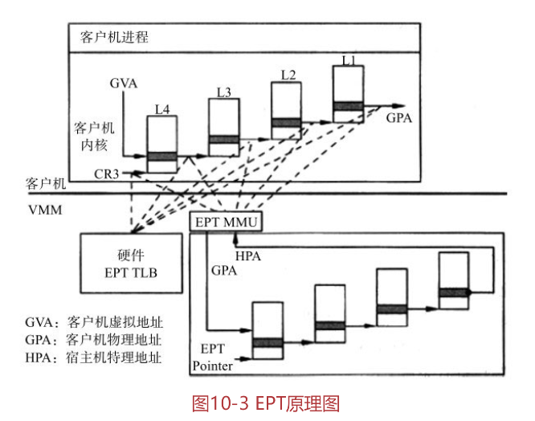

### 10.1.3 I/O虚拟化

> I/O虚拟化包括**管理虚拟设备**和**共享的物理硬件**之间**I/O请求的路由选择**。
>
> 实现I/O虚拟化有三种方式：（1）I/O全虚拟化、（2）I/O半虚拟化和（3）I/O透传

#### 2 I/O半虚拟化

> 客户机能感知到自己是虚拟机。
>
> 对于I/O系统来说，通过前端驱动/后端驱动模拟实现I/O虚拟化。客户机中的驱动程序为前端，宿主机提供的与客户机通信的驱动程序为后端。
>
> **前端驱动**将客户机的请求通过与宿主机间的特殊通信机制发送给后端驱动，**后端驱动**在处理完请求后再发送给**物理驱动**。
>
> 比如说XEN，就是通过**事件通道**、**授权表**以及**共享内存的机制**来使得虚拟机中的前端驱动和宿主机中的后端驱动来通信。

> 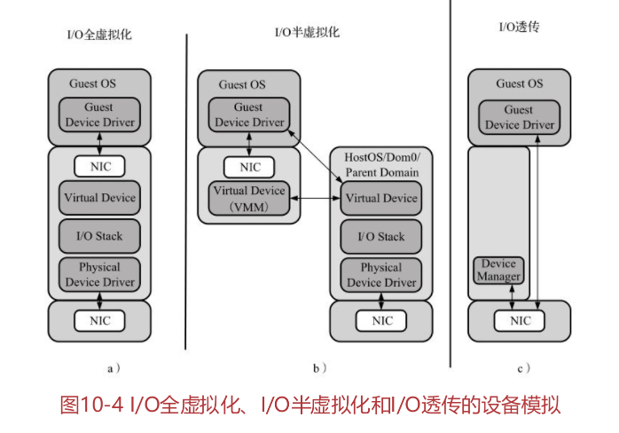

#### 3 I/O透传

> 直接把物理设备分配给虚拟机使用

## 10.3 PCIe网卡透传下的收发包流程

> 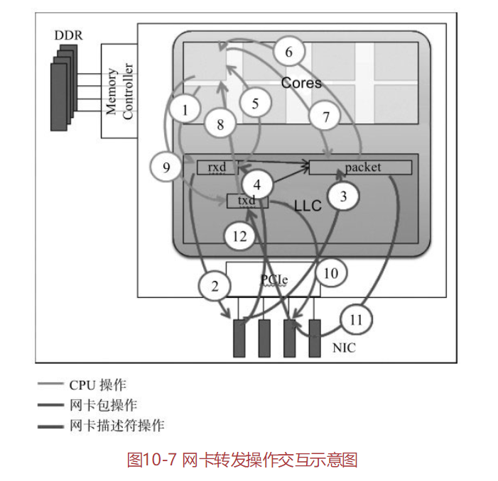
>
> 1. CPU填充缓冲地址到接收侧描述符
> 2. 网卡读取接收侧描述符获取缓冲区地址
> 3. 网卡将包的内容写到缓冲区地址处
> 4. 网卡回写接收侧描述符更新状态（确认包内容已写完）
> 5. CPU读取接收侧描述符以确定包接收完毕
> 6. CPU读取包内容做转发判断
> 7. CPU填充更改包内容，做发送准备
> 8. CPU读发送侧描述符，检查是否有发送完成标志
> 9. CPU将准备发送的缓冲区地址填充到发送侧描述符
> 10. 网卡读取发送侧描述符中地址
> 11. 网卡根据描述符中地址，读取缓冲区中数据内容
> 12. 网卡写发送侧描述符，更新发送已完成标记

# 第11章  半虚拟化Virtio

## 11.1 Virtio 使用场景

> I/O透传的一个典型问题是从物理网卡接收到的数据包将直接到达客户机的接收队列，或者从客户机发送队列发出的包将直接到达其他客户机（比如同一个PF的VF）的接收队列或者直接从物理网卡发出，绕过了宿主机的参与；
>
> 但在很多应用场景下，有需求要求网络包必须先经过宿主机的处理（如防火墙、负载均衡等），再传递给客户机。另外，I/O透传技术不能从硬件上支持**虚拟机的动态迁移**以及缺乏**足够灵活的流分类规则**。

> Virtio设备的一种典型场景:
>
> 宿主机使用**虚拟交换机**连通**物理网卡**和**虚拟机**。虚拟交换机内部有一个**DPDK Vhost**，实现了Virtio的后端网络设备驱动程序逻辑。虚拟机里有DPDK的**Virtio前端网络设备驱动**。前端和后端通过**Virtio的虚拟队列**交换数据。这样虚拟机里的网络数据便可以发送到虚拟交换机中，然后经过转发逻辑，可以经由物理网卡进入外部网络

## 11.2 Virtio规范和原理

Virtio规范主要有两个版本，0.95和1.0，其规定的实现接口有PCI、MMIO（内存映射）和Channel IO方式，而Channel IO方式是1.0规范中新加的。

## TODO  该章节剩余部分专业参数配置，目前暂时不需要阅读

# 12章  加速包处理的vhost优化方案

第11章主要介绍了virtio-net网络设备的前端驱动设计，本章将介绍其对应的后端驱动vhost设计。

## TODO： 未读

# 第三部分DPDK应用篇

# 第13章  DPDK与网络功能虚拟化

## 13.1 网络功能虚拟化

### 13.1.1 起源

> 目前的网络架构中，可以经常遇见下面一些网络设备：
>
> ❑Message Router：消息路由器。
>
> ❑CDN：内容传送网络，加速缓冲内容（如视频）业务。
>
> ❑Session Boarder Controller：会话边界控制器，用于电话或无线信令控制。❑WAN Accerleration：广域网加速。
>
> ❑DPI：深度报文检测。❑Firewall：防火墙，阻断恶意攻击。
>
> ❑Carrier-Grade NAT：运营商级网络地址转换。
>
> ❑Tester/QoE Monitor： 测试与网络质量监控。
>
> ❑BRAS：宽带接入设备服务。❑PE Router：运营商路由器。
>
> ❑SGSN/GGSN：移动核心网关，支撑数据业务。
>
> ❑Radio/Fixed Access Network：无线或者有线接入网络。

## 13.2 OPNFV与DPDK

# 第15章 基于DPDK的存储软件优化

> DPDK技术只关注OSI协议的第二和第三层

> DPDK的主要特点:
>
> 1. ❑用户态的网络驱动：使用**轮询方式**的用户态网络驱动，替换了基于中断模式的内核态网络驱动。
> 2. ❑基于大页的内存管理：DPDK的**大页机制**是预先分配一块内存，进行独立的内存管理。
> 3. ❑基于pthread的CPU调度机制：目前DPDK使用了pthread开发库，在系统中把相应的线程和CPU进行**亲和性**的绑定，这样，相应的线程尽可能使用独立的资源进行相关的数据处理工作。

## 15.1 基于以太网的存储系统

> 目前，DPDK相关技术主要用于**以太网协议的网卡优化**。
>
> 网络存储系统：这些存储服务可以分为以下几类：文件存储（f ile）、块存储（block）和对象存储（object）。

> 我们可以简单了解一下，现有的**基于服务器的存储系统**怎么处理相关的读写操作。假设有一个来自用户请求（如图15-3所示）的写操作，那么会有以下的流程：
>
> 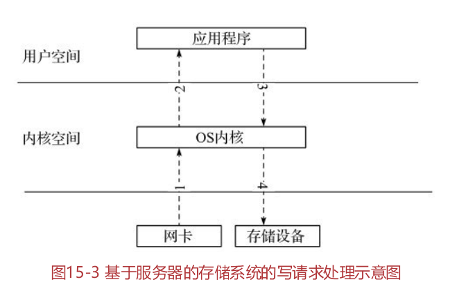
>
> 1）网卡收到相应的数据。
>
> 2）内核把相应的数据从内核态**拷贝**到位于用户态的**daemon**（守护进程）。
>
> 3）daemon守护进程调用写服务，要求内核写回存储设备。
>
> 4）为此相应节点的内核收到相应的请求，把数据从用户态**拷贝**到内核态，然后调用相应的存储驱动来进行写操作。

## 15.2 以太网存储系统的优化

> 首先，我们可以利用DPDK来优化网络驱动，通过**无锁硬件访问技术**加速报文处理，例如Intel网卡的Flow Director技术将指定的TCP流导入到特定的硬件队列，针对每个Connection（连接）分配不同的**TX/RX队**列。
>
> 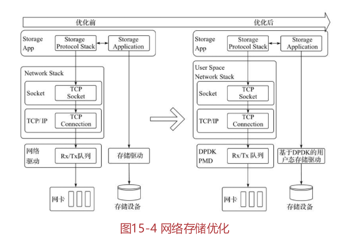
> 其次，在Socket协议层，我们可以利用DPDK去除共享数据结构的内核锁，降低内核驱动的延时和上下文切换，加速数据处理，从而实现高效的用户态网络协议栈。
>
> 另外，我们还可以使用DPDK技术实现用户态下的存储设备驱动，最大限度地减少内存拷贝和延时，提高数据吞吐量。

> 网络存储都需要相应的网络栈，即利用“已经存在的物理网络”加“上层的的网络协议”。
>
> 目前的DPDK没有提供正式支持的用户态网络协议栈，仅提供了使用**轮询工作模式**的**诸多以太网卡的驱动**，可以进行简单的以太网收发包的工作。这意味着DPDK**只能工作**在OSI 7层协议的**第2层（link）和第3层（IP）上**，还没有提供基于第4层（协议层）相关的网络传输协议，比如TCP/IP协议。
>
> 但已经有些商业（TCP/IP）软件栈提供了这样的方案

## 15.3 SPDK介绍

> SPDK（Storage Performance DevelopmentKit）是一套基于IA平台上的软件加速库和解决存储方案
>
> **SPDK架构**包含以下内容（如图15-5所示）:DPDK的代码库，一个用户态的TCP/IP栈，一些用户态的存储相关的驱动（比如用户态的基于NVME的SSD驱动），一个基于DPDK和用户态TCP/IP栈的iSCSI target的应用程序。
>
> 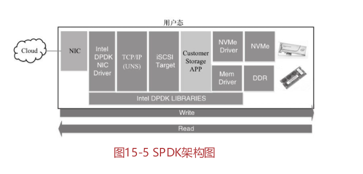

> 用户所发送数据需要通过内核协议栈的协助，这样就会产生用户态和内核态的上下文切换，并且产生用户空间和内核空间之间的数据拷贝。而图的右侧显示了基于用户态的软件协议栈，比如DPDK、UDS等，应用程序必须**绕过**内核所提供的TCP/IP/UDP协议栈。
>
> 这是一个比较简单的方法，通过应用程序调用自定义的接口，这样的方法降低了实现上的难度，但是不兼容已有的应用程序
>
> 已有的应用程序必须做代码上的修改，才能使用新的用户态网络协议栈。因此，用户态的TCP/IP/UDP协议栈，必须为上层的应用提供一个友好的机制，让用户使用已有的接口，但是可以绕过现有内核的实现。
>
> SPDK中的libuns提供了以下的解决方案：监控打开socket操作相关的文件描述符（f ile descriptor），当调用标准库操作的时候（诸如linux下是glibc），进行截获，一旦发现是监控的文件描述符，就调用用户态的函数。
>
> 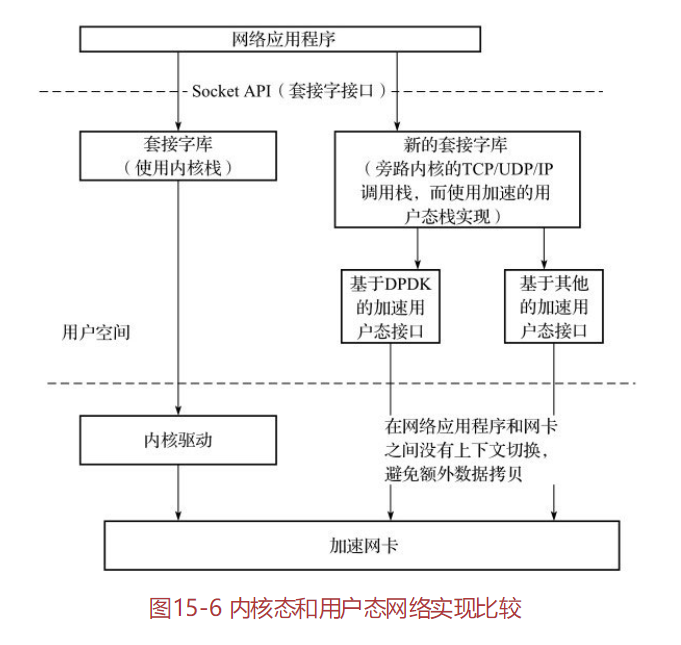

> **开源项目MTCP**是一个针对多核架构设计的高可扩展的用户态TCP/IP栈的实现，针对高并发的连接和网络处理进行专门的优化。

### 用户态存储驱动

> 为了更好地发挥DPDK的优势，SPDK提供了一些用户态的存储驱动，诸如基于NVME协议的SSD的用户态驱动

## TODO  NVME 和SPDK性能测试未读

# 推荐阅读：

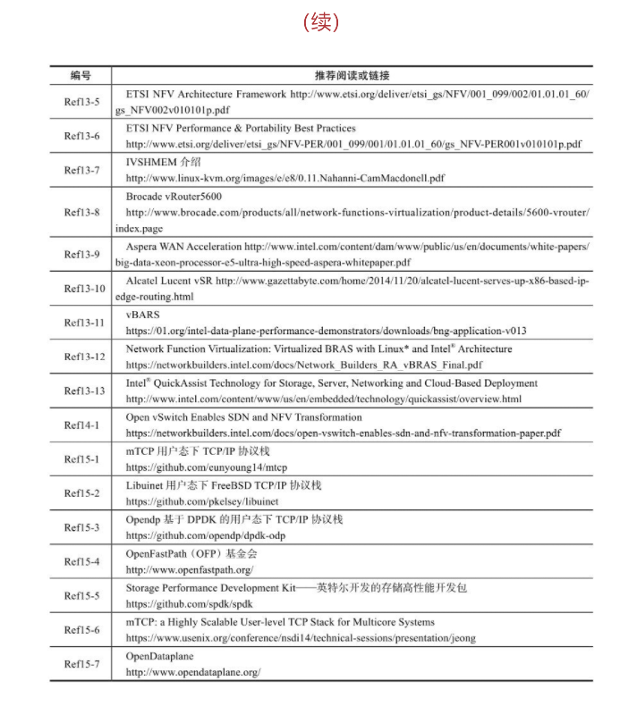

