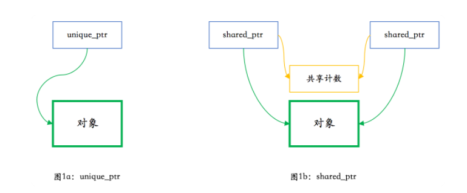
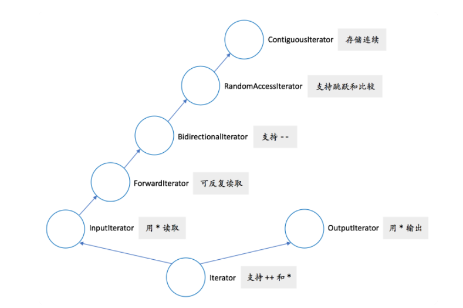

# 基础篇

## 01 堆、栈、RAII：C++里该如何管理资源

### 堆

内存泄漏案例：

```c
void foo()
{
  bar* ptr = new bar();
  …
  delete ptr;
}
```

上述代码存在两个问题：

1. 中间省略的代码部分也许会抛出异常，导致最后的 delete ptr 得不到执行。
2. 更重要的，这个代码不符合 C++ 的惯用法。在 C++ 里，这种情况下有 99% 的可能性不应该使用堆内存分配，而应使用栈内存分配。这样写代码的，估计可能是从 Java 转过来的🤭——但我真见过这样的代码。

而更合理的情况如下：

```c
bar* make_bar(…)
{
  bar* ptr = nullptr;
  try {
    ptr = new bar();
    …
  }
  catch (...) {
    delete ptr;
    throw;
  }
  return ptr;
}

void foo()
{
  …
  bar* ptr = make_bar(…)
  …
  delete ptr;
}
```

### RAII

C++ 支持将对象存储在栈上面。但是，在很多情况下，对象不能，或不应该，存储在**栈**上。比如：

- 对象很大
- 对象的大小在编译时不能确定
- 对象时函数的返回值，但是由于特殊的原因，不应使用对象的值返回


常见情况之一，在工厂方法或其他面向对象编程的情况下，返回值类型是基类（的指针或引用）。下面的例子，是对工厂方法的简单演示：

```c
enum class shape_type {
  circle,
  triangle,
  rectangle,
  …
};

class shape { … };
class circle : public shape { … };
class triangle : public shape { … };
class rectangle : public shape { … };

shape* create_shape(shape_type type)
{
  …
  switch (type) {
  case shape_type::circle:
    return new circle(…);
  case shape_type::triangle:
    return new triangle(…);
  case shape_type::rectangle:
    return new rectangle(…);
  …
  }
}
```

???  这个 create_shape 方法会返回一个 shape 对象，对象的实际类型是某个 shape 的子类，圆啊，三角形啊，矩形啊，等等。这种情况下，函数的返回值只能是指针或其变体形式。如果返回类型是 shape，实际却返回一个 circle，编译器不会报错，但结果多半是错的。这种现象叫对象切片（object slicing），是 C++ 特有的一种编码错误。这种错误不是语法错误，而是一个对象复制相关的语义错误，也算是 C++ 的一个陷阱了，大家需要小心这个问题。

那么，我们怎样才能确保，在使用 create_shape 的返回值时不会发生内存泄漏呢？

答案就在析构函数和它的栈展开行为上。我们只需要把这个返回值放到一个本地变量里，并确保其析构函数会删除该对象即可。一个简单的实现如下所示：

```c++
enum class shape_type {
  circle,
  triangle,
  rectangle,
  …
};

class shape { … };
class circle : public shape { … };
class triangle : public shape { … };
class rectangle : public shape { … };


class shape_wrapper {
public:
  explicit shape_wrapper(shape* ptr = nullptr): ptr_(ptr) {}
  
  ~shape_wrapper()
  {
    delete ptr_;
  }
  
  shape* get() const { return ptr_; }
  
private:
  shape* ptr_;
};

void foo()
{
  …
  shape_wrapper ptr_wrapper(
    create_shape(…));
  …
}
```

如果你好奇 delete 空指针会发生什么的话，那答案是，这是一个合法的空操作。

```c
if (ptr != nullptr) {
  ptr->~shape();
  operator delete(ptr);
}
```

回到 shape_wrapper 和它的析构行为。在析构函数里做必要的清理工作，这就是 RAII 的基本用法。这种清理并不限于释放内存，也可以是：

- 关闭文件（fstream 的析构就会这么做）
- 释放同步锁
- 释放其他重要的系统资源

## 02 自己动手，实现C++的智能指针

### 回顾

我们上一讲给出了下面这个类：

```c++
class shape_wrapper {
public:
  explicit shape_wrapper(shape* ptr = nullptr): ptr_(ptr) {}
    
  ~shape_wrapper()
  {
    delete ptr_;
  }
  shape* get() const { return ptr_; }

private:
  shape* ptr_;
};
```

*explicit：指定构造函数或转换函数 (C++11 起) 或推导指南 (C++17 起) 是显式的，也就是说，它不能用于隐式转换和复制初始化。*

这个类可以完成智能指针的最基本的功能：对超出作用域的对象进行释放。**但它缺了点东西：**

1. 这个类只适用于 shape 类
2. 该类对象的行为不够像指针
3. 拷贝该类对象会引发程序行为异常

下面我们来逐一看一下怎么弥补这些问题。

### 模板化和易用性

要让这个类能够包装任意类型的指针，我们需要把它变成一个类模板。这实际上相当容易：

```c++
template <typename T>
class smart_ptr {
public:
  explicit smart_ptr(T* ptr = nullptr) : ptr_(ptr) {}
  ~smart_ptr()
  {
    delete ptr_;
  }
  T* get() const { return ptr_; }
    
private:
  T* ptr_;
};
```

*移动构造函数：*

*=delete，C++11中，当我们定义一个类的成员函数时，如果后面使用"=delete"去修饰，那么就表示这个函数被定义为deleted，也就意味着这个成员函数不能再被调用，否则就会出错。*

#### 引用计数

unique_ptr 和 shared_ptr 的主要区别如下：



现在我们可以实现我们的引用计数智能指针了。首先是构造函数、析构函数和私有成员变量：

```c++
template <typename T>
class smart_ptr {
public:
  explicit smart_ptr(T* ptr = nullptr)
    : ptr_(ptr)
  {
    if (ptr) {
      shared_count_ =
        new shared_count();
    }
  }
  ~smart_ptr()
  {
    if (ptr_ &&
      !shared_count_
         ->reduce_count()) {
      delete ptr_;
      delete shared_count_;
    }
  }

private:
  T* ptr_;
  shared_count* shared_count_;
};
```


下面是一个完整的 smart_ptr 代码：

```c++
#include <utility>  // std::swap

class shared_count {
public:
  shared_count() noexcept
    : count_(1) {}
  void add_count() noexcept
  {
    ++count_;
  }
  long reduce_count() noexcept
  {
    return --count_;
  }
  long get_count() const noexcept
  {
    return count_;
  }

private:
  long count_;
};

template <typename T>
class smart_ptr {
public:
  template <typename U>
  friend class smart_ptr;

  explicit smart_ptr(T* ptr = nullptr)
    : ptr_(ptr)
  {
    if (ptr) {
      shared_count_ =
        new shared_count();
    }
  }
  ~smart_ptr()
  {
    if (ptr_ &&
      !shared_count_
         ->reduce_count()) {
      delete ptr_;
      delete shared_count_;
    }
  }

  smart_ptr(const smart_ptr& other)
  {
    ptr_ = other.ptr_;
    if (ptr_) {
      other.shared_count_
        ->add_count();
      shared_count_ =
        other.shared_count_;
    }
  }
  template <typename U>
  smart_ptr(const smart_ptr<U>& other) noexcept
  {
    ptr_ = other.ptr_;
    if (ptr_) {
      other.shared_count_->add_count();
      shared_count_ = other.shared_count_;
    }
  }
  template <typename U>
  smart_ptr(smart_ptr<U>&& other) noexcept
  {
    ptr_ = other.ptr_;
    if (ptr_) {
      shared_count_ =
        other.shared_count_;
      other.ptr_ = nullptr;
    }
  }
  template <typename U>
  smart_ptr(const smart_ptr<U>& other,
            T* ptr) noexcept
  {
    ptr_ = ptr;
    if (ptr_) {
      other.shared_count_
        ->add_count();
      shared_count_ =
        other.shared_count_;
    }
  }
  smart_ptr&
  operator=(smart_ptr rhs) noexcept
  {
    rhs.swap(*this);
    return *this;
  }

  T* get() const noexcept
  {
    return ptr_;
  }
  long use_count() const noexcept
  {
    if (ptr_) {
      return shared_count_
        ->get_count();
    } else {
      return 0;
    }
  }
  void swap(smart_ptr& rhs) noexcept
  {
    using std::swap;
    swap(ptr_, rhs.ptr_);
    swap(shared_count_,
         rhs.shared_count_);
  }

  T& operator*() const noexcept
  {
    return *ptr_;
  }
  T* operator->() const noexcept
  {
    return ptr_;
  }
  operator bool() const noexcept
  {
    return ptr_;
  }

private:
  T* ptr_;
  shared_count* shared_count_;
};

template <typename T>
void swap(smart_ptr<T>& lhs,
          smart_ptr<T>& rhs) noexcept
{
  lhs.swap(rhs);
}

template <typename T, typename U>
smart_ptr<T> static_pointer_cast(
  const smart_ptr<U>& other) noexcept
{
  T* ptr = static_cast<T*>(other.get());
  return smart_ptr<T>(other, ptr);
}

template <typename T, typename U>
smart_ptr<T> reinterpret_pointer_cast(
  const smart_ptr<U>& other) noexcept
{
  T* ptr = reinterpret_cast<T*>(other.get());
  return smart_ptr<T>(other, ptr);
}

template <typename T, typename U>
smart_ptr<T> const_pointer_cast(
  const smart_ptr<U>& other) noexcept
{
  T* ptr = const_cast<T*>(other.get());
  return smart_ptr<T>(other, ptr);
}

template <typename T, typename U>
smart_ptr<T> dynamic_pointer_cast(
  const smart_ptr<U>& other) noexcept
{
  T* ptr = dynamic_cast<T*>(other.get());
  return smart_ptr<T>(other, ptr);
}
```


# 03 | 右值和移动究竟解决了什么问题？

> C++ 里，所有的原生类型、枚举、结构、联合、类都代表值类型，只有引用（&）和指针（*）才是引用类型。在 Java 里，数字等原生类型是值类型，类则属于引用类型。在 Python 里，一切类型都是引用类型。

## **生命周期和表达式类型**

> C++ 的规则是：一个临时对象会在包含这个临时对象的完整表达式估值完成后、按生成顺序的逆序被销毁，除非有生命周期延长发生。

C++ 对临时对象有特殊的生命周期延长规则。这条规则是：

> 如果一个 prvalue （纯右值）被绑定到一个引用上，它的生命周期则会延长到跟这个引用变量一样长。

## 移动的意义

在使用容器类的情况下，移动更有意义。我们可以尝试分析一下下面这个假想的语句（假设 name 是 string 类型）：

```c++
string result =
  string("Hello, ") + name + ".";
```

在 C++11 之前的年代里，这种写法是绝对不推荐的。因为它会引入很多额外开销，执行流程大致如下：

1. 调用构造函数 string(const char*)，生成临时对象 1；"Hello, " 复制 1 次。*
2. *调用 operator+(const string&, const string&)，生成临时对象 2；"Hello, " 复制 2 次，name 复制 1 次。*
3. *调用 operator+(const string&, const char*)，生成对象 3；"Hello, " 复制 3 次，name 复制 2 次，"." 复制 1 次。
4. 假设返回值优化能够生效（最佳情况），对象 3 可以直接在 result 里构造完成。
5. 临时对象 2 析构，释放指向 string("Hello, ") + name 的内存。
6. 临时对象 1 析构，释放指向 string("Hello, ") 的内存。

既然 C++ 是一门追求性能的语言，一个合格的 C++ 程序员会写：

```c++
string result = "Hello, ";
result += name;
result += ".";
```

这样的话，只会调用构造函数一次和 string::operator+= 两次，没有任何临时对象需要生成和析构，所有的字符串都只复制了一次。但显然代码就啰嗦多了——尤其如果拼接的步骤比较多的话。从 C++11 开始，这不再是必须的。同样上面那个单行的语句，执行流程大致如下：

1. 调用构造函数 string(const char*)，生成临时对象 1；"Hello, " 复制 1 次。*
2. *调用 operator+(string&&, const string&)，直接在临时对象 1 上面执行追加操作，并把结果移动到临时对象 2；name 复制 1 次。*
3. *调用 operator+(string&&, const char*)，直接在临时对象 2 上面执行追加操作，并把结果移动到 result；"." 复制 1 次。
4. 临时对象 2 析构，内容已经为空，不需要释放任何内存。
5. 临时对象 1 析构，内容已经为空，不需要释放任何内存。

性能上，所有的字符串只复制了一次；虽然比啰嗦的写法仍然要增加临时对象的构造和析构，但由于这些操作不牵涉到额外的内存分配和释放，是相当廉价的。**程序员只需要牺牲一点点性能，就可以大大增加代码的可读性。**


此外很关键的一点是，C++ 里的对象缺省都是值语义。在下面这样的代码里：

```c++
class A {
  B b_;
  C c_;
};
```

从实际内存布局的角度，很多语言——如 Java 和 Python——会在 A 对象里放 B 和 C 的指针（虽然这些语言里本身没有指针的概念）。**而 C++ 则会直接把 B 和 C 对象放在 A 的内存空间里**。这种行为既是优点也是缺点。说它是优点，是因为它**保证了内存访问的局域性**，而局域性在现代处理器架构上是绝对具有性能优势的。说它是缺点，是因为**复制对象的开销大大增加**：在 Java 类语言里复制的是指针，在 C++ 里是完整的对象。这就是为什么 C++ 需要移动语义这一优化，而 Java 类语言里则根本不需要这个概念。

## 如何实现移动？


## 不要返回本地变量的引用

在 C++11 之前，返回一个本地对象意味着这个对象会被拷贝，除非编译器发现可以做返回值优化（named return value optimization，或 **NRVO**），**能把对象直接构造到调用者的栈上**。从 C++11 开始，返回值优化仍可以发生，但在没有返回值优化的情况下，编译器将试图**把本地对象移动出去**，而不是拷贝出去。

```c++
#include <iostream>  // std::cout/endl
#include <utility>   // std::move

using namespace std;

class Obj {
public:
  Obj()
  {
    cout << "Obj()" << endl;
  }
  Obj(const Obj&)
  {
    cout << "Obj(const Obj&)"
       << endl;
  }
  Obj(Obj&&)
  {
    cout << "Obj(Obj&&)" << endl;
  }
};

Obj simple()
{
  Obj obj;
  // 简单返回对象；一般有 NRVO
  return obj;
}

Obj simple_with_move()
{
  Obj obj;
  // move 会禁止 NRVO
  return std::move(obj);
}

Obj complicated(int n)
{
  Obj obj1;
  Obj obj2;
  // 有分支，一般无 NRVO
  if (n % 2 == 0) {
    return obj1;
  } else {
    return obj2;
  }
}

int main()
{
  cout << "*** 1 ***" << endl;
  auto obj1 = simple();
  cout << "*** 2 ***" << endl;
  auto obj2 = simple_with_move();
  cout << "*** 3 ***" << endl;
  auto obj3 = complicated(42);
}
```


## 引用坍缩和完美转发


# 04 | 容器汇编 I：比较简单的若干容器

我们需要一个更好用的工具。在此，我向你大力推荐 **xeus-cling**。它的便利性无与伦比——你可以直接在浏览器里以交互的方式运行代码，不需要本机安装任何编译器。

## string

跟其他大部分容器一样， string 具有下列成员函数：

- begin 可以得到对象起始点
- end 可以得到对象的结束点
- empty 可以得到容器是否为空
- size 可以得到容器的大小
- swap 可以和另外一个容器交换其内容

所有容器的共同点了。几乎是如下：

- 容器都有开始和结束点

- 容器会记录其状态是否非空
- 容器有大小
- 容器支持交换

## vector

当 push_back、insert、reserve、resize 等函数导致内存重分配时，或当 insert、erase 导致元素位置移动时，vector 会试图把元素“移动”到新的内存区域。vector 通常保证强异常安全性，如果元素类型没有提供一个保证不抛异常的移动构造函数，vector 通常会使用拷贝构造函数。因此，对于拷贝代价较高的自定义元素类型，我们应当定义移动构造函数，并标其为 noexcept，或只在容器中放置对象的智能指针。这就是为什么我之前需要在 smart_ptr 的实现中标上 noexcept 的原因。

vector 的一个主要缺陷是大小增长时导致的元素移动。如果可能，尽早使用 reserve 函数为 vector 保留所需的内存，这在 vector 预期会增长很大时能带来很大的性能提升。

## deque


## list

虽然 list 提供了任意位置插入新元素的灵活性，但由于每个元素的内存空间都是单独分配、不连续，它的遍历性能比 vector 和 deque 都要低。


## forward_list


## queue

它们的特别点在于它们都不是完整的实现，而是依赖于某个现有的容器，因而被称为容器适配器（container adaptor）。


## stack

它们的特别点在于它们都不是完整的实现，而是依赖于某个现有的容器，因而被称为容器适配器（container adaptor）。


# 05 | 容器汇编 II：需要函数对象的容器

## 函数对象及其特化

less

hash

## priority_queue

priority_queue 也是一个容器适配器。上一讲没有和其他容器适配器一起讲的原因就在于它用到了比较函数对象（默认是 less）。

## 关联容器

关联容器有 set（集合）、map（映射）、multiset（多重集）和 multimap（多重映射）。跳出 C++ 的语境，map（映射）的更常见的名字是关联数组和字典，而在 JSON 里直接被称为对象（object）。在 C++ 外这些容器常常是无序的；在 C++ 里关联容器则被认为是有序的。

如果在声明关联容器时没有提供比较类型的参数，缺省使用 less 来进行排序。如果键的类型提供了比较算符 < 的重载，我们不需要做任何额外的工作。

## 无序关联容器

从 C++11 开始，每一个关联容器都有一个对应的无序关联容器，它们是：

- unordered_set
- unordered_map
- unordered_multiset
- unordered_multimap

## array

我们讲的最后一个容器是 C 数组的替代品。C 数组在 C++ 里继续存在，主要是为了保留和 C 的向后兼容性。C 数组本身和 C++ 的容器相差是非常大的：

- C 数组没有 begin 和 end 成员函数（虽然可以使用全局的 begin 和 end 函数）
- C 数组没有 size 成员函数（得用一些模板技巧来获取其长度）
- C 数组作为**参数有退化行为**，传递给另外一个函数后那个函数不再能获得 C 数组的长度和结束位置

# 06 | 异常：用还是不用，这是个问题

异常 该用。如果你需要避免使用异常，原因必须是你有明确的需要避免使用异常的理由。

如果出错位置离处理错误的位置相差很远的话，**每一层的函数调用里都得有判断错误码的代码**，这就既对写代码的人提出了严格要求，也对读代码的人造成了视觉上的干扰……

## 使用异常

异常处理并不意味着需要写显式的 try 和 catch。**异常安全的代码，可以没有任何 try 和 catch。**

**异常安全**：我们先来温习一下概念：异常安全是指当异常发生时，既不会发生资源泄漏，系统也不会处于一个不一致的状态。

使用异常会带来二进制文件大小的上升，以及性能的降低，但是除非在极端追求性能的场景下，目前主流的c++编译器在异常关闭和开启时应该已经能够产生性能差不多的代码（在异常未抛出时）。

## 使用异常的理由

标准库的错误处理方式就是异常。其中不仅包括运行时错误，甚至包括一些逻辑错误。

比如，在说容器的时候，有一个我没提的地方是，在能使用 [] 运算符的地方，C++ 的标准容器也提供了 at 成员函数，能够在下标不存在的时候抛出异常，作为一种额外的帮助调试的手段

C++ 的标准容器在大部分情况下提供了**强异常保证**，即，<u>一旦异常发生，现场会恢复到调用函数之前的状态，容器的内容不会发生改变，也没有任何资源泄漏。</u>


# 07 | 迭代器和好用的新for循环

注意在 C++17 之前，begin 和 end 返回的类型 I 和 S 必须是相同的。从 C++17 开始，I 和 S 可以是不同的类型。这带来了更大的灵活性和更多的优化可能性。

而比输入迭代器和输出迭代器更底层的概念，就是迭代器了。基本要求是：

- 对象可以被拷贝构造、拷贝赋值和析构。
- 对象支持 * 运算符。
- 对象支持前置 ++ 运算符。

迭代器类型的关系可从下图中全部看到：



指针可以满足上面所有的迭代器要求，因而也是迭代器。

## 常用迭代器

最常用的迭代器就是容器的 iterator 类型了。以我们学过的顺序容器为例，它们都定义了嵌套的 iterator 类型和 const_iterator 类型。一般而言，iterator 可写入，const_iterator 类型不可写入，但这些迭代器都被定义为输入迭代器或其派生类型：

- vector::iterator 和 array::iterator 可以满足到连续迭代器。
- deque::iterator 可以满足到随机访问迭代器（记得它的内存只有部分连续）。
- list::iterator 可以满足到双向迭代器（链表不能快速跳转）。
- forward_list::iterator 可以满足到前向迭代器（单向链表不能反向遍历）

很常见的一个输出迭代器是 back_inserter 返回的类型 back_inserter_iterator 了；用它我们可以很方便地在容器的尾部进行插入操作。另外一个常见的输出迭代器是 ostream_iterator，方便我们把容器内容“拷贝”到一个输出流。示例如下：

```c++
#include <algorithm>  // std::copy
#include <iterator>   // std::back_inserter
#include <vector>     // std::vector
using namespace std;

vector<int> v1{1, 2, 3, 4, 5};
vector<int> v2;
copy(v1.begin(), v1.end(),
     back_inserter(v2));
// { 1, 2, 3, 4, 5 }

#include <iostream>  // std::cout
copy(v2.begin(), v2.end(),
     ostream_iterator<int>(cout, " "));
// 1 2 3 4 5
```


## 定义输入行迭代器

把一个输入流（istream）的内容一行行读进来。配上 C++11 引入的基于范围的 for 循环的语法，我们可以把遍历输入流的代码以一种自然、非过程式的方式写出来:

```c++
for (const string& line :
     istream_line_reader(is)) {
  // 示例循环体中仅进行简单输出
  cout << line << endl;
}
```

我们可以对比一下以传统的方式写的 C++ 代码，其中需要照顾不少细节：

```c++
string line;
for (;;) {
  getline(is, line);
  if (!is) {
    break;
  }
  cout << line << endl;
}
```

我们后面会分析一下这个输入迭代器。在此之前，我先解说一下基于范围的 for 循环这个语法。虽然这可以说是个语法糖，但它对提高代码的可读性真的非常重要。如果不用这个语法糖的话，简洁性上的优势就小多了。我们直接把这个循环改写成等价的普通 for 循环的样子。

```c++
{
  auto&& r = istream_line_reader(is);
  auto it = r.begin();
  auto end = r.end();
  for (; it != end; ++it) {
    const string& line = *it;
    cout << line << endl;
  }
}
```

可以看到，它做的事情也不复杂，就是：

- 获取冒号后边的范围表达式的结果，并隐式产生一个引用，在整个循环期间都有效。注**意根据生命期延长规则，表达式结果如果是临时对象的话，这个对象要在循环结束后才被销毁。**
- 自动生成遍历这个范围的迭代器。
- 循环内自动生成根据冒号左边的声明和 *it 来进行初始化的语句。


